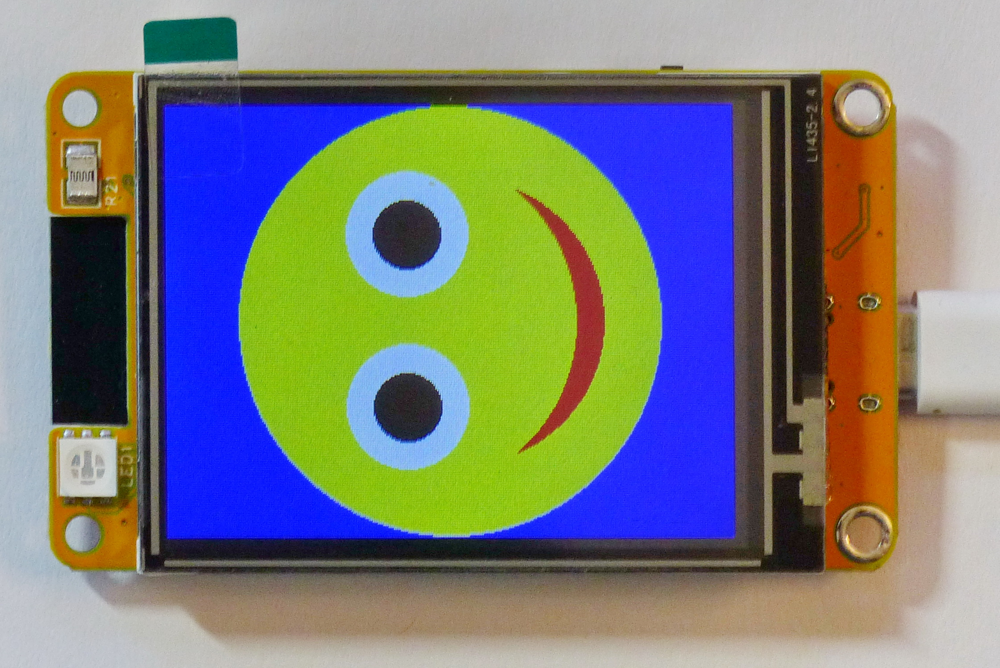
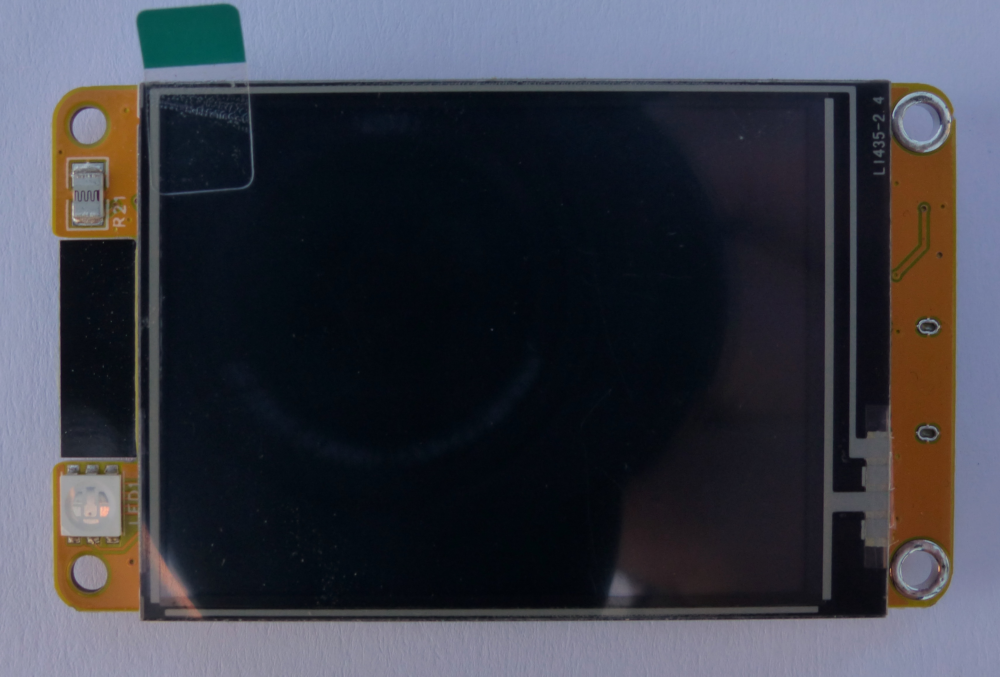
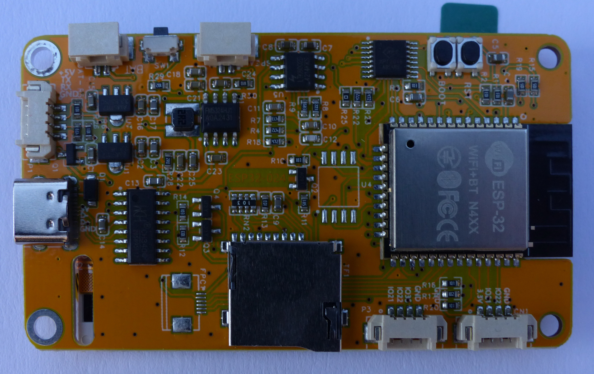

## TZT ESP32-2432S024R
### ESP32 module with LCD display and resistive touch screen

This is just another clone of the famous CYD ESP32-2432S028x (Cheap Yellow Display) module, but with 2.4" LCD-TFT display installed.
The R at the end of the module name stands for resistive touch screen.

refer to: [TZT store](https://www.tztstore.com/goods/show-7983.html) In the download section you will find a zip file with informations about the display includung some example sources for arduino IDE and firmware. Use at your own risk! My display came with the arduino-LVGL examle installed. But flashing the bin included in this zip file does not fit the LCD display installed.

Unfortunately I missed to read out the original firmware correctly before experimenting with this module.

The PSRAM solder area is not equipped with an IC.

For a nice and helpfull resource for these kinds of display refer to: [cool-web.de](https://cool-web.de/esp8266-esp32/) and some nternals 
[cool-web.de - CYD pinout](https://cool-web.de/esp8266-esp32/esp32-2432s028-cheap-yellow-display-touchscreen-vorstellung-hardware-pinout.htm)

The LDR is not working. It reads out at 0,08V contantly regardeless the light exposure. This is a known issue and design fault. For possible fixes see: [arduino forum](https://forum.arduino.cc/t/how-to-efficiently-read-a-photoresistor-without-wasting-power/1180415/5) and [hexeguitar](https://github.com/hexeguitar/ESP32_TFT_PIO)

The Onboard LED red is weak. Selecting white is emmited as blue.

I did not test the SD-Card slot and I2S Audio output because there is no native ESPHome support and I'm not going to use these features

The flash_download_tool_3.9.9_R2 device_info response:
'''
start detect chip...please wait
chip sync ...
Chip is ESP32-D0WD-V3 (revision v3.1)
Features: Wi-Fi, BT, Dual Core + LP Core, 240MHz, Vref calibration in eFuse, Coding Scheme None
Crystal is 40MHz
MAC: 4cc382d2a3f8
Manufacturer: 5e
Device: 4016
Status value: 0x100200
Detected flash size: 4MB
'''

